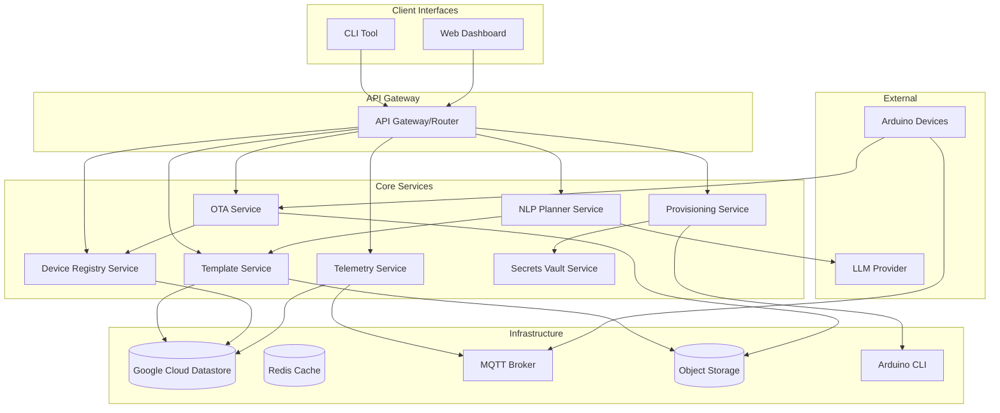

# Design Document

## Overview

ATHENA is designed as a microservices-based platform with clear separation between template management, natural language processing, device provisioning, and telemetry services. The architecture supports both local-only and cloud-hosted deployments, with a focus on developer experience and security.

The system follows a layered architecture:
- **Presentation Layer**: CLI tool and Web UI
- **Application Layer**: Core business logic services
- **Infrastructure Layer**: Data storage, message queues, and external integrations
- **Device Layer**: Arduino firmware with HAL abstraction

## Architecture



## Components and Interfaces

### Template Service

**Responsibilities:**
- Manage template repository and metadata
- Validate template schemas and compatibility
- Handle template versioning and dependencies
- Generate wiring diagrams and documentation

**Key Interfaces:**
```go
type TemplateService interface {
    ListTemplates(filters TemplateFilters) ([]Template, error)
    GetTemplate(id string, version string) (*Template, error)
    ValidateTemplate(template *Template) (*ValidationResult, error)
    RenderTemplate(id string, params map[string]interface{}) (*RenderedTemplate, error)
    GenerateWiringDiagram(template *Template, params map[string]interface{}) (*WiringDiagram, error)
}

type Template struct {
    ID              string                 `json:"id"`
    Name            string                 `json:"name"`
    Version         string                 `json:"version"`
    Category        string                 `json:"category"`
    BoardsSupported []string               `json:"boards_supported"`
    Schema          *jsonschema.Schema     `json:"schema"`
    Parameters      map[string]interface{} `json:"parameters"`
    Libraries       []LibraryDependency    `json:"libraries"`
    Assets          []Asset                `json:"assets"`
}
```

### NLP Planner Service

**Responsibilities:**
- Parse natural language requirements
- Extract technical specifications and constraints
- Select appropriate templates based on requirements
- Fill template parameters automatically
- Validate electrical safety and compatibility

**Key Interfaces:**
```go
type NLPPlannerService interface {
    ParseRequirements(input string) (*ParsedRequirements, error)
    GeneratePlan(requirements *ParsedRequirements) (*ImplementationPlan, error)
    ValidatePlan(plan *ImplementationPlan) (*ValidationResult, error)
}

type ParsedRequirements struct {
    Intent      string            `json:"intent"`
    Sensors     []SensorSpec      `json:"sensors"`
    Actuators   []ActuatorSpec    `json:"actuators"`
    Communication []CommSpec      `json:"communication"`
    Constraints map[string]interface{} `json:"constraints"`
    BoardPreference string         `json:"board_preference"`
}

type ImplementationPlan struct {
    TemplateID    string                 `json:"template_id"`
    Parameters    map[string]interface{} `json:"parameters"`
    WiringDiagram *WiringDiagram        `json:"wiring_diagram"`
    BOM          []BOMItem              `json:"bom"`
    Warnings     []string               `json:"warnings"`
}
```

### Provisioning Service

**Responsibilities:**
- Compile Arduino firmware using Arduino CLI
- Flash firmware to connected devices
- Inject secrets securely during provisioning
- Perform post-flash health checks
- Register devices in the registry

**Key Interfaces:**
```go
type ProvisioningService interface {
    CompileTemplate(template *RenderedTemplate, board string) (*CompilationResult, error)
    FlashDevice(binary []byte, port string) (*FlashResult, error)
    VerifyDevice(port string) (*HealthCheck, error)
    ProvisionDevice(request *ProvisionRequest) (*ProvisionResult, error)
}

type ProvisionRequest struct {
    TemplateID   string                 `json:"template_id"`
    Parameters   map[string]interface{} `json:"parameters"`
    Board        string                 `json:"board"`
    Port         string                 `json:"port"`
    Secrets      map[string]string      `json:"secrets"`
}
```

### Device Registry Service

**Responsibilities:**
- Track device lifecycle and status
- Manage device metadata and configuration
- Handle device authentication and authorization
- Provide device search and filtering capabilities

**Key Interfaces:**
```go
type DeviceRegistryService interface {
    RegisterDevice(device *Device) error
    GetDevice(deviceID string) (*Device, error)
    ListDevices(filters DeviceFilters) ([]Device, error)
    UpdateDeviceStatus(deviceID string, status DeviceStatus) error
    DecommissionDevice(deviceID string) error
}

type Device struct {
    DeviceID     string                 `json:"device_id"`
    BoardType    string                 `json:"board_type"`
    Status       DeviceStatus           `json:"status"`
    TemplateID   string                 `json:"template_id"`
    Version      string                 `json:"version"`
    Parameters   map[string]interface{} `json:"parameters"`
    FirmwareHash string                 `json:"firmware_hash"`
    LastSeen     time.Time              `json:"last_seen"`
    OTAChannel   string                 `json:"ota_channel"`
}
```

### Telemetry Service

**Responsibilities:**
- Ingest device telemetry via MQTT and HTTP
- Process and store time-series data
- Provide real-time data streaming
- Generate alerts based on thresholds

**Key Interfaces:**
```go
type TelemetryService interface {
    IngestTelemetry(deviceID string, data *TelemetryData) error
    GetDeviceMetrics(deviceID string, timeRange TimeRange) ([]MetricPoint, error)
    StreamDeviceData(deviceID string) (<-chan *TelemetryData, error)
    SetAlertThreshold(deviceID string, metric string, threshold *AlertThreshold) error
}

type TelemetryData struct {
    DeviceID  string                 `json:"device_id"`
    Timestamp time.Time              `json:"timestamp"`
    Metrics   map[string]interface{} `json:"metrics"`
    Tags      map[string]string      `json:"tags"`
}
```

### OTA Service

**Responsibilities:**
- Manage firmware releases and channels
- Handle staged rollouts and rollbacks
- Verify device authentication for updates
- Track update status and history

**Key Interfaces:**
```go
type OTAService interface {
    CreateRelease(release *FirmwareRelease) error
    DeployRelease(releaseID string, deployment *DeploymentConfig) error
    GetUpdateForDevice(deviceID string) (*FirmwareUpdate, error)
    ReportUpdateStatus(deviceID string, status *UpdateStatus) error
    RollbackRelease(releaseID string) error
}

type FirmwareRelease struct {
    ReleaseID    string    `json:"release_id"`
    TemplateID   string    `json:"template_id"`
    Version      string    `json:"version"`
    BinaryHash   string    `json:"binary_hash"`
    Signature    string    `json:"signature"`
    CreatedAt    time.Time `json:"created_at"`
    ReleaseNotes string    `json:"release_notes"`
}
```

## Data Models

### Template Repository Schema

**Datastore Entities:**

```go
// Template entity
type TemplateEntity struct {
    ID              string                 `datastore:"id"`
    Name            string                 `datastore:"name"`
    Version         string                 `datastore:"version"`
    Category        string                 `datastore:"category"`
    Description     string                 `datastore:"description"`
    SchemaJSON      string                 `datastore:"schema_json,noindex"`
    ParametersJSON  string                 `datastore:"parameters_json,noindex"`
    BoardsSupported []string               `datastore:"boards_supported"`
    LibrariesJSON   string                 `datastore:"libraries_json,noindex"`
    CreatedAt       time.Time              `datastore:"created_at"`
    UpdatedAt       time.Time              `datastore:"updated_at"`
}

// Template asset entity
type TemplateAssetEntity struct {
    TemplateID      string                 `datastore:"template_id"`
    TemplateVersion string                 `datastore:"template_version"`
    AssetType       string                 `datastore:"asset_type"` // 'wiring_diagram', 'documentation', 'image'
    AssetPath       string                 `datastore:"asset_path"`
    MetadataJSON    string                 `datastore:"metadata_json,noindex"`
    CreatedAt       time.Time              `datastore:"created_at"`
}

// Datastore keys and indexes
// Key format: templates/{id}#{version}
// Composite indexes: [category, created_at], [boards_supported, category]
```

### Device Registry Schema

**Datastore Entities:**

```go
// Device entity
type DeviceEntity struct {
    DeviceID        string                 `datastore:"device_id"`
    BoardType       string                 `datastore:"board_type"`
    Status          string                 `datastore:"status"` // 'provisioned', 'online', 'offline', 'error'
    TemplateID      string                 `datastore:"template_id"`
    TemplateVersion string                 `datastore:"template_version"`
    ParametersJSON  string                 `datastore:"parameters_json,noindex"`
    SecretsRef      string                 `datastore:"secrets_ref"`
    FirmwareHash    string                 `datastore:"firmware_hash"`
    LastSeen        time.Time              `datastore:"last_seen"`
    OTAChannel      string                 `datastore:"ota_channel"`
    CreatedAt       time.Time              `datastore:"created_at"`
    UpdatedAt       time.Time              `datastore:"updated_at"`
}

// Device telemetry entity (time-series data)
type DeviceTelemetryEntity struct {
    DeviceID      string                 `datastore:"device_id"`
    Timestamp     time.Time              `datastore:"timestamp"`
    MetricName    string                 `datastore:"metric_name"`
    MetricValue   float64                `datastore:"metric_value"`
    MetricString  string                 `datastore:"metric_string"`
    TagsJSON      string                 `datastore:"tags_json,noindex"`
}

// Datastore keys and indexes
// Device key format: devices/{device_id}
// Telemetry key format: telemetry/{device_id}#{timestamp_nanos}
// Composite indexes: [status, last_seen], [template_id, created_at], [device_id, timestamp]
```

### OTA Management Schema

**Datastore Entities:**

```go
// Firmware release entity
type FirmwareReleaseEntity struct {
    ReleaseID     string                 `datastore:"release_id"`
    TemplateID    string                 `datastore:"template_id"`
    Version       string                 `datastore:"version"`
    BinaryHash    string                 `datastore:"binary_hash"`
    BinaryPath    string                 `datastore:"binary_path"`
    Signature     string                 `datastore:"signature,noindex"`
    ReleaseNotes  string                 `datastore:"release_notes,noindex"`
    CreatedAt     time.Time              `datastore:"created_at"`
}

// OTA deployment entity
type OTADeploymentEntity struct {
    DeploymentID        string                 `datastore:"deployment_id"`
    ReleaseID           string                 `datastore:"release_id"`
    DeploymentStrategy  string                 `datastore:"deployment_strategy"` // 'immediate', 'staged', 'canary'
    TargetDevices       []string               `datastore:"target_devices"`
    RolloutPercentage   int                    `datastore:"rollout_percentage"`
    Status              string                 `datastore:"status"` // 'pending', 'active', 'paused', 'completed', 'failed'
    CreatedAt           time.Time              `datastore:"created_at"`
    UpdatedAt           time.Time              `datastore:"updated_at"`
}

// Device update status entity
type DeviceUpdateEntity struct {
    DeviceID      string                 `datastore:"device_id"`
    ReleaseID     string                 `datastore:"release_id"`
    Status        string                 `datastore:"status"` // 'pending', 'downloading', 'installing', 'completed', 'failed'
    StartedAt     time.Time              `datastore:"started_at"`
    CompletedAt   time.Time              `datastore:"completed_at"`
    ErrorMessage  string                 `datastore:"error_message,noindex"`
}

// Datastore keys and indexes
// Release key format: releases/{release_id}
// Deployment key format: deployments/{deployment_id}
// Update key format: updates/{device_id}#{release_id}
// Composite indexes: [template_id, created_at], [status, created_at], [device_id, started_at]
```

## Error Handling

### Error Classification

**System Errors:**
- Template validation failures
- Compilation errors
- Hardware communication failures
- Database connection issues

**User Errors:**
- Invalid parameter values
- Unsupported board/sensor combinations
- Missing required secrets
- Port access denied

**Device Errors:**
- Flash verification failures
- Runtime crashes
- Communication timeouts
- OTA update failures

### Error Response Format

```go
type APIError struct {
    Code      string            `json:"code"`
    Message   string            `json:"message"`
    Details   map[string]string `json:"details,omitempty"`
    Timestamp time.Time         `json:"timestamp"`
    RequestID string            `json:"request_id"`
}

// Standard error codes
const (
    ErrTemplateNotFound     = "TEMPLATE_NOT_FOUND"
    ErrInvalidParameters    = "INVALID_PARAMETERS"
    ErrCompilationFailed    = "COMPILATION_FAILED"
    ErrDeviceNotConnected   = "DEVICE_NOT_CONNECTED"
    ErrFlashFailed          = "FLASH_FAILED"
    ErrSecretsNotFound      = "SECRETS_NOT_FOUND"
    ErrElectricalSafety     = "ELECTRICAL_SAFETY_VIOLATION"
)
```

### Retry and Circuit Breaker Patterns

```go
type RetryConfig struct {
    MaxAttempts   int           `json:"max_attempts"`
    InitialDelay  time.Duration `json:"initial_delay"`
    MaxDelay      time.Duration `json:"max_delay"`
    BackoffFactor float64       `json:"backoff_factor"`
}

// Circuit breaker for external services
type CircuitBreaker struct {
    FailureThreshold int
    RecoveryTimeout  time.Duration
    OnStateChange    func(from, to State)
}
```

## Testing Strategy

### Unit Testing

**Template Service Tests:**
- Schema validation with valid/invalid templates
- Parameter rendering with various data types
- Wiring diagram generation accuracy
- Library dependency resolution

**NLP Service Tests:**
- Natural language parsing with diverse inputs
- Template selection accuracy
- Parameter extraction and validation
- Safety rule enforcement

**Provisioning Service Tests:**
- Arduino CLI integration with mocked hardware
- Secret injection without exposure
- Error handling for compilation failures
- Health check validation

### Integration Testing

**End-to-End Workflows:**
- Complete template selection → compilation → flash → verification
- Natural language input → working device deployment
- OTA update deployment and rollback scenarios
- Multi-device telemetry collection and dashboard display

**API Contract Testing:**
- Service interface compatibility
- Error response format consistency
- Authentication and authorization flows
- Rate limiting and throttling behavior

### Hardware-in-the-Loop Testing

**Device Compatibility:**
- Template compilation across supported boards
- Flash verification on physical hardware
- Sensor reading accuracy and timing
- Communication protocol validation

**Performance Testing:**
- Compilation time benchmarks
- Flash operation reliability
- Telemetry throughput limits
- Dashboard responsiveness under load

### Security Testing

**Secrets Management:**
- Credential injection without persistence
- Secure storage and retrieval
- Access control validation
- Audit trail completeness

**Device Security:**
- OTA update signature verification
- Device authentication mechanisms
- Communication encryption
- Vulnerability scanning of generated firmware

## Deployment Architecture

### Local Development Mode

```yaml
# docker-compose.dev.yml
version: '3.8'
services:
  datastore-emulator:
    image: google/cloud-sdk:alpine
    command: >
      sh -c "gcloud beta emulators datastore start --host-port=0.0.0.0:8081 --project=athena-dev"
    ports:
      - "8081:8081"
    environment:
      CLOUDSDK_CORE_PROJECT: athena-dev
  
  redis:
    image: redis:7-alpine
    ports:
      - "6379:6379"
  
  mosquitto:
    image: eclipse-mosquitto:2
    ports:
      - "1883:1883"
      - "9001:9001"
  
  minio:
    image: minio/minio
    command: server /data --console-address ":9001"
    ports:
      - "9000:9000"
      - "9001:9001"
    environment:
      MINIO_ROOT_USER: athena
      MINIO_ROOT_PASSWORD: dev_password
```

### Production Deployment

**Kubernetes Manifests:**
- Separate deployments for each microservice
- Horizontal Pod Autoscaling based on CPU/memory
- Google Cloud Datastore integration via service accounts
- Persistent volumes for object storage and Redis
- Service mesh for inter-service communication
- Ingress controller for external access

**Monitoring and Observability:**
- Prometheus metrics collection
- Grafana dashboards for system health
- Jaeger distributed tracing
- ELK stack for centralized logging
- Alert manager for critical issues

This design provides a robust, scalable foundation for the ATHENA platform while maintaining clear separation of concerns and supporting both local development and production deployment scenarios.